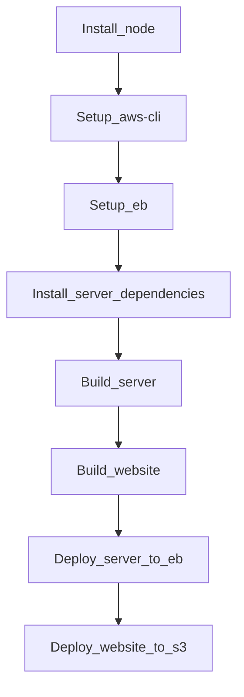
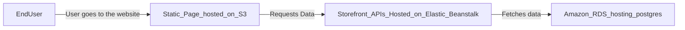

# Hosting a Storefront Backend Application

---

This project is a simple hosting project for frontend side and backend side with the integration with the database. For hosting the application, there's a CirclCi pipeline to automate building and deploying into Elastic Beanstalk environment and S3 Buckets(AWS Services).
The Project can be accessed through the following [link](http://deploybucket0.s3.us-east-1.amazonaws.com/index.html) where the products of the store will be accessed.

### Project Structure
```
- .circleci: contains the pipeline process.
- server: contains the server side code.
- website: contains the client side code.
```
### App Dependencies

```
- Node v16.18.0.

- AWS CLI v2.

- A RDS database running Postgres.

- A S3 bucket for hosting frontend side.
```
### Pipeline Process


[](https://dl.circleci.com/status-badge/redirect/gh/AhmedGomaa013/Storefront-Backend-FWD-Nanodegree/tree/main)


### AWS Services Diagram


### Environment Statuses

- AWS RDS. 
- AWS Elastic Beanstalk. 
- AWS Bucket S3. 
- CircleCi with Github. 
- Environment Variables Configurations. 
