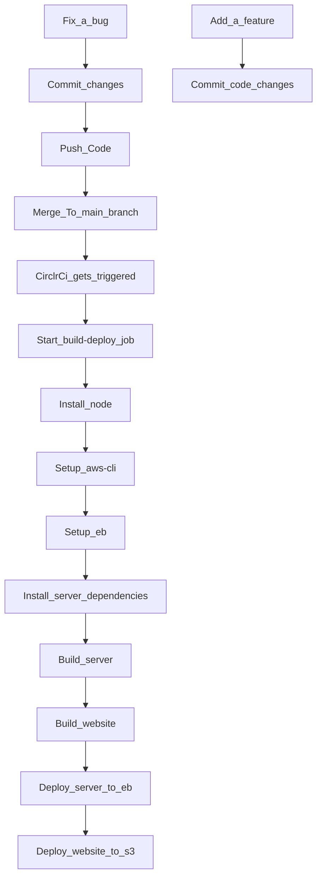

### Pipeline Process
---

```mermaid
graph TD;
    Fix_a_bug --> Commit_changes;
    Add_a_feature --> Commit_code_changes;
    Commit_changes --> Push_Code --> Merge_To_main_branch --> CirclrCi_gets_triggered --> Start_build-deploy_job --> Install_node;
    Install_node --> Setup_aws-cli --> Setup_eb --> Install_server_dependencies --> Build_server --> Build_website --> Deploy_server_to_eb --> Deploy_website_to_s3;
```

